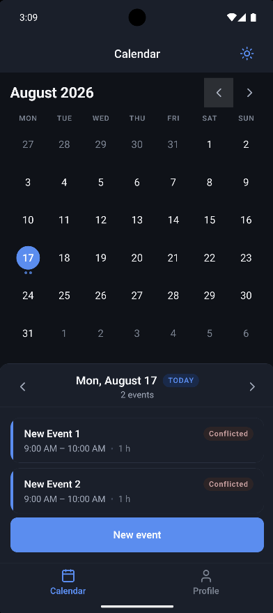
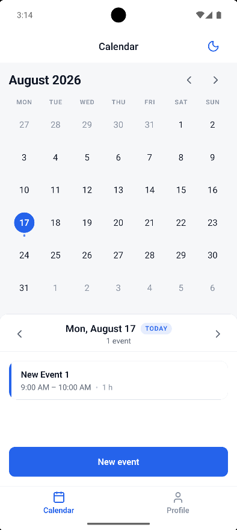
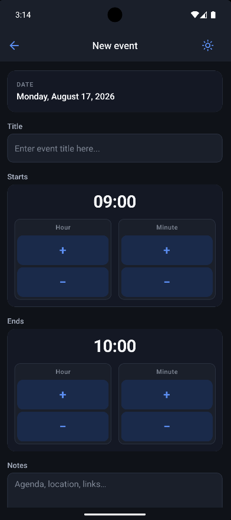
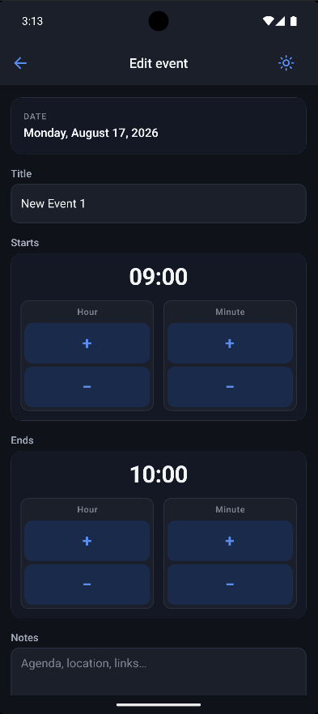
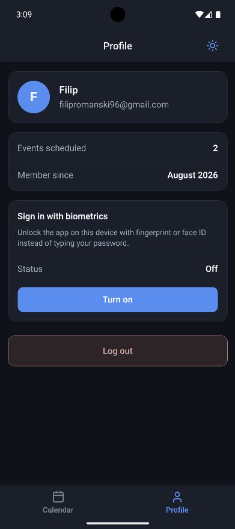
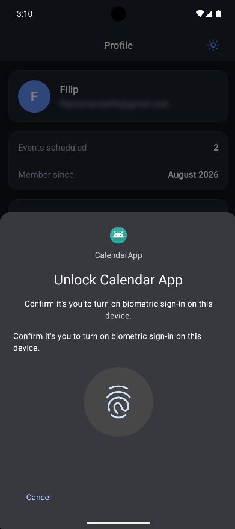
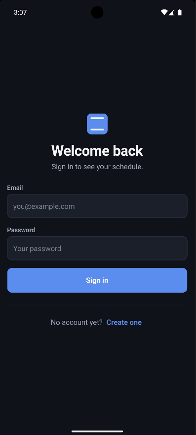
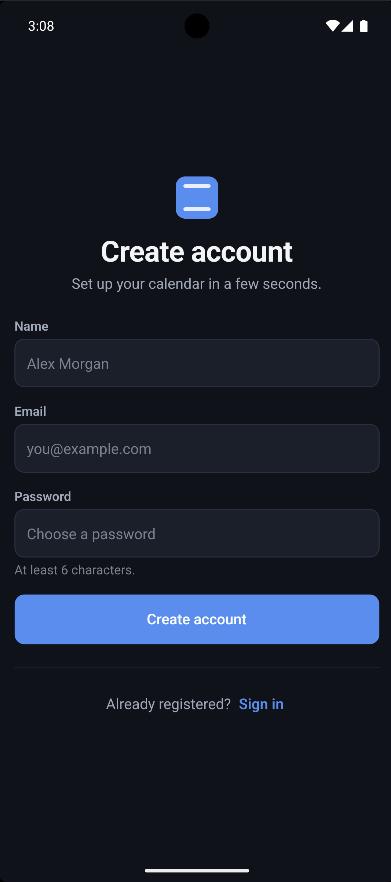
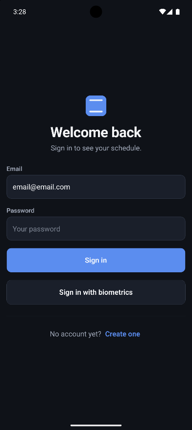
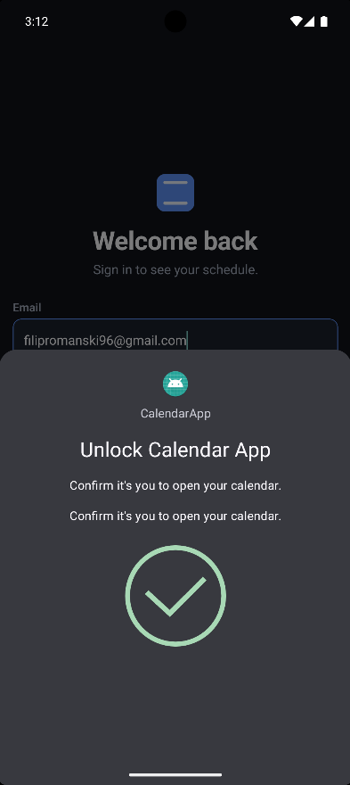

# Calendar App

A calendar and meeting-management app for Android, built with plain React Native (no Expo) and TypeScript. Registration and sign-in, a custom month calendar, event create/edit, and a profile screen with logout.

`CalendarApp` / `com.calendarapp` are technical identifiers, not product branding.

## Screenshots

### Calendar

Month grid, selected-day agenda, event-count dots, and overlap badges. Appearance follows the header sun/moon control.

<table>
  <tr>
    <td align="center" valign="top" width="50%">
      <p><strong>Dark</strong></p>
      
    </td>
    <td align="center" valign="top" width="50%">
      <p><strong>Light</strong></p>
      
    </td>
  </tr>
</table>

### Events

One form for create and edit: title, notes, start and end on the civil day.

<table>
  <tr>
    <td align="center" valign="top" width="50%">
      <p><strong>New event</strong></p>
      
    </td>
    <td align="center" valign="top" width="50%">
      <p><strong>Edit event</strong></p>
      
    </td>
  </tr>
</table>

### Profile

Identity, scheduled-event count, and the on-device biometric gate.

<table>
  <tr>
    <td align="center" valign="top" width="50%">
      <p><strong>Account</strong></p>
      
    </td>
    <td align="center" valign="top" width="50%">
      <p><strong>Enable biometrics</strong></p>
      
    </td>
  </tr>
</table>

### Sign in

Email/password on a fresh install; Create account is the adjacent stack screen.

<table>
  <tr>
    <td align="center" valign="top" width="50%">
      <p><strong>Sign in</strong></p>
      
    </td>
    <td align="center" valign="top" width="50%">
      <p><strong>Create account</strong></p>
      
    </td>
  </tr>
</table>

### Biometric unlock

After the gate is on, a restored session lands on Sign in with a biometric control. The system prompt unlocks the existing Firebase session.

<table>
  <tr>
    <td align="center" valign="top" width="50%">
      <p><strong>Locked session</strong></p>
      
    </td>
    <td align="center" valign="top" width="50%">
      <p><strong>System prompt</strong></p>
      
    </td>
  </tr>
</table>

## Contents

- [Screenshots](#screenshots)
- [What it does](#what-it-does)
- [Prerequisites](#prerequisites)
- [Install and run](#install-and-run)
- [Testing](#testing)
- [Structure](#structure)
- [Documentation](#documentation)

## What it does

- Email/password registration and sign-in via Firebase Authentication, with per-field validation and distinct failure messages. Optional biometric unlock on this device after the user turns it on in Profile. Firebase remains the identity; biometrics gate an existing session.
- Calendar dashboard: six-row month grid, month and day paging, Today shortcut, event-count dots, selected-day agenda, overlap (“Conflicted”) badges.
- Event create and edit through one form (same validation and hook).
- Profile: signed-in user, event count, biometric setup, logout.
- Auth-gated navigation: authenticated and unauthenticated screens are mutually exclusive groups of one root stack. Logout returns to sign-in automatically.

The calendar is implemented with React Native primitives (`CalendarDate` / `TimeOfDay` in domain code).

## Prerequisites

1. **Node.js 24.x** (or 22.13+). Check with `node -v`.
2. **JDK 17.** React Native 0.87's Gradle 9.4.1 wrapper requires 17 or newer. Set `JAVA_HOME` to the JDK root, e.g. `C:\Program Files\Microsoft\jdk-17.0.20.8-hotspot`.
3. **Android Studio** (Narwhal or newer) with the Android SDK.
4. `ANDROID_HOME` pointing at the SDK, e.g. `%LOCALAPPDATA%\Android\Sdk`, with `%ANDROID_HOME%\platform-tools` on `PATH`.

Verify:

```powershell
node -v
java -version
echo $env:JAVA_HOME
echo $env:ANDROID_HOME
adb version
```

SDK platforms, emulator acceleration, iOS, and Windows path length: [docs/setup.md](docs/setup.md).

## Install and run

```powershell
npm install

# iOS only (macOS with CocoaPods): autolinking is not enough for pods
cd ios; pod install; cd ..

# Terminal 1 - Metro
npm start

# Terminal 2 - build, install, and launch on the running emulator or device
npm run android
```

`npm run android` is `react-native run-android`. React Native Firebase, MMKV (Nitro), Keychain, and SVG are autolinked; Android applies the Google services plugin in `android/app/build.gradle`.

## Testing

```powershell
npm run typecheck    # tsc --noEmit
npm run lint         # eslint .
npm test             # jest
npm run test:coverage
```

The suite has **131 tests across 16 Jest files** (plus `src/navigation/types.test-d.ts`, typecheck only). `jest.config.js` sets coverage thresholds just below the measured numbers so a regression fails the build. Native `firebaseAuthService` / `firestoreEventService` are excluded; they need the Android Firebase SDK. Firestore rules are checked in the Console simulator, not an in-repo emulator.

## Structure

```
src/
  app/          AppShell, App, services.ts
  navigation/   typed navigators
  domain/       date, events, auth
  services/     auth, events, biometrics, storage
  features/     auth, calendar, events, profile
  ui/           theme + presentational components
  testing/      Jest fakes
```

`app → navigation → features → domain | services | ui | lib`. [Architecture](docs/architecture.md). [Accounts, meetings, and device data](docs/persistence.md).

## Documentation

- [Running the app](docs/setup.md)
- [Architecture](docs/architecture.md)
- [Accounts, meetings, and device data](docs/persistence.md)

Agent coding standards live in `.cursor/rules/`.
